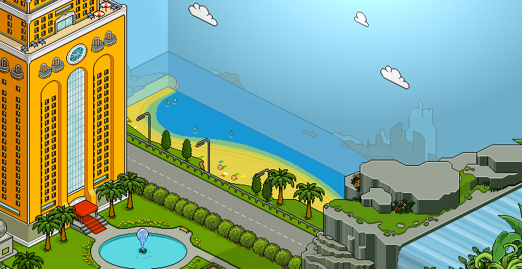

<p align="center">
  
</p>

<h1 align="center">Habbo V26 · Remake</h1>

<p align="center">
  <i>Un proyecto personal para poner al día mi versión favorita de Habbo Hotel: la <b>v26</b> (2008–2009).</i>
</p>

<p align="center">
  
  
  
  
  
</p>

---

## 👋 ¿Qué es esto?

La **v26** fue la versión de Habbo Hotel de **2008–2009**: el cliente clásico hecho en
**Adobe Shockwave**, con su vista de hotel, su navegador de salas y ese pixel-art que
muchos recordamos con cariño. Era **mi versión favorita** y este repo es mi intento
personal de **rescatarla y ponerla al día** para que funcione en un mundo moderno.

El problema: la v26 dependía de **Shockwave**, una tecnología muerta que **ningún
navegador actual ejecuta**, y de un emulador pensado para **Windows**. Este proyecto
lo resuelve: levanta todo el hotel —web, base de datos, emulador y cliente— **con un
solo `docker compose up`**, sin Windows, sin plugins, y con el cliente corriendo
**dentro del navegador mediante WebAssembly**.

> ⚠️ **Proyecto personal y educativo**, sin ánimo de lucro. No está afiliado a Sulake.
> *Habbo* y *Habbo Hotel* son marcas de **Sulake Oy**; todos los assets originales
> pertenecen a sus dueños.

---

## ✨ Lo que ya funciona

- 🐳 **Todo dockerizado** — un único `docker compose up` levanta la base de datos, la
  web, los assets del cliente, el emulador y el puente de red.
- 🎮 **El cliente v26 corre en el navegador** — el cliente Shockwave se ejecuta vía
  **[DirPlayer](https://github.com/igorlira/dirplayer-rs)** (un reproductor de
  Director/Shockwave en Rust → WebAssembly). Renderiza el hotel, conecta con el
  emulador, hace login y navega salas. **Sin Shockwave, sin PaleMoon, sin plugins.**
- 🧬 **Emulador sin Windows** — el *Holograph Emulator* (.NET) se **recompila con Mono**
  y se conecta a la base de datos por **ODBC**, todo dentro de un contenedor Linux.
- 🌐 **Puente WebSocket ↔ TCP** — como los navegadores no abren sockets TCP, un proxy
  traduce la conexión del cliente al emulador.
- 🧑‍🎨 **Editor de avatares (kekos)** — el editor Flash original corre con
  **[Ruffle](https://ruffle.rs/)** (Flash → WebAssembly); puedes cambiar tu look y
  guardarlo.
- 🇪🇸 **Todo en español** — CMS y cliente traducidos por completo, con la **vista de
  hotel española**.
- 🖼️ **Avatares servidos en local** — generación de imágenes de avatar con caché propia.

---

## 🛠️ En lo que estoy trabajando (rework)

Este es el corazón del proyecto: modernizar las tripas sin perder la esencia v26.

| Área | De | A | Estado |
|------|----|----|--------|
| **Web / CMS** | HoloCMS (PHP 5.2, 2008) | **Laravel 13 / PHP 8.3** | 🟡 migración por fases (*strangler pattern*) |
| **Cliente** | Shockwave plugin | **DirPlayer (WASM)** | 🟢 jugable, puliendo |
| **Editor de avatares** | Flash plugin | **Ruffle (WASM)** | 🟢 funcionando |
| **Emulador** | binario Windows | **Mono + ODBC (Linux)** | 🟢 funcionando |
| **Infra** | VPS Windows manual | **Docker Compose** | 🟢 funcionando |
| **Idioma** | francés / inglés | **español** | 🟢 completado |

El CMS legacy se va reemplazando **pieza a pieza** por Laravel mientras sigue
funcionando en cada momento (en vez de una reescritura de golpe). El plan completo
y el seguimiento están en [`/docs`](docs/).

**Siguientes pasos:** seguir migrando vistas del CMS a Laravel, pulir la fidelidad
visual del cliente, y avanzar hacia un imager de avatares 100 % local.

---

## 🚀 Cómo levantarlo

Requisitos: **Docker** y **Docker Compose**.

```bash
git clone https://github.com/EnriqueGF/habbo-v26-remake.git
cd habbo-v26-remake
docker compose up -d        # la primera vez compila el emulador (Mono) — tarda un poco
```

Cuando los contenedores estén arriba:

| Servicio | URL / Puerto |
|----------|--------------|
| 🌐 **Web del hotel** | http://localhost:8090 |
| 📦 Assets del cliente (DCRs) | http://localhost:8091 |
| 🎮 Emulador (juego / MUS) | `127.0.0.1:1232` · `30000` |
| 🔌 Puente WebSocket↔TCP | `8092` · `8093` |
| 🗄️ Base de datos (MariaDB) | `127.0.0.1:3307` |

**Cuenta de administrador de ejemplo:** `admin` / `admin`

Para entrar al hotel: regístrate o entra con la cuenta admin y pulsa **«Entrar a Habbo»**.
El cliente carga en el navegador (recomendado **Chrome/Edge** por su soporte de WebGPU,
que da el mejor render del editor de avatares).

> Las credenciales del `docker-compose.yml` son de **desarrollo local**. Cámbialas si
> lo expones fuera de tu máquina.

---

## 🧩 Arquitectura

```
Navegador ─┬─ Web (Laravel 13 / PHP 8.3 + HoloCMS legacy in-process)   :8090
           ├─ Cliente Shockwave  → DirPlayer (WASM)
           │        │
           │        └─ WebSocket ─→ proxy ─→ TCP ─→ Emulador (Mono+ODBC) :1232/:30000
           ├─ Editor de avatares → Ruffle (WASM)
           └─ DCRs / assets (nginx)                                      :8091
                                  Base de datos: MariaDB                 :3307
```

### Estructura del repo

```
apps/web/        Web moderna (Laravel 13) + HoloCMS legacy bajo /legacy
services/
  emulator/      Holograph Emulator (.NET) — se compila con Mono en runtime
assets/dcr/      Assets Shockwave del cliente v26 (.dcr / .cct)
database/        Volcado de la BD + ajustes de arranque
docker/          Dockerfiles de cada servicio
docs/            Plan de modernización, fases y decisiones
```

---

## 🙏 Créditos

Este proyecto se apoya en el trabajo de mucha gente de la comunidad retro de Habbo:

- **Pack base v26** — [HRWCMS](https://github.com/EudesFR/HRWCMS) (CMS HRW, Holograph
  Emulator y DCRs).
- **HoloCMS** — Meth0d · **Holograph Emulator** — Meth0d / equipo Holograph.
- **[DirPlayer](https://github.com/igorlira/dirplayer-rs)** — emulador de Shockwave en
  Rust/WASM, de igorlira (con el *bobba-xtra* de chameleonxxl).
- **[Ruffle](https://ruffle.rs/)** — emulador de Flash en Rust/WASM.

Gracias a toda la comunidad que mantuvo viva la v26.

---

## ⚖️ Aviso legal

Proyecto **personal, educativo y sin ánimo de lucro**, hecho por nostalgia. No está
afiliado, asociado ni respaldado por **Sulake Oy**. *Habbo*, *Habbo Hotel* y los
nombres, gráficos y assets relacionados son **propiedad de Sulake**. Si eres titular
de derechos y quieres que se retire algo, abre un *issue*.

El **código propio** de modernización (Laravel, Docker, integraciones) se publica con
fines de aprendizaje. Los assets originales de Habbo **no** son míos ni se licencian
aquí.
